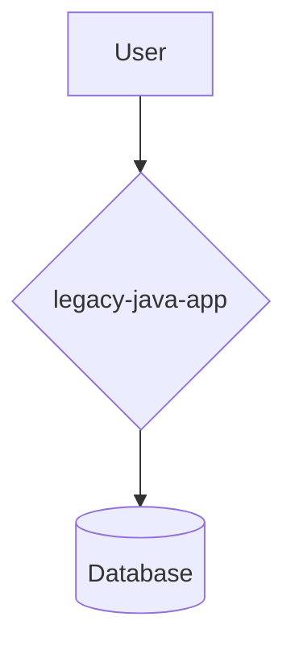
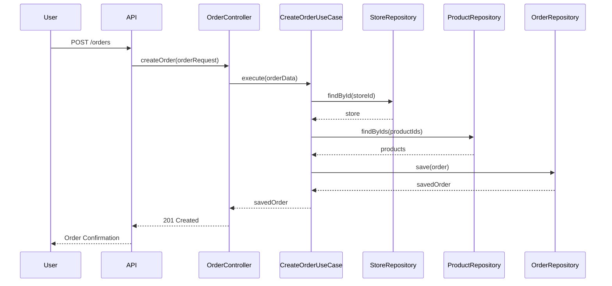

# Legacy Java App Architecture Document

## Introduction

This document outlines the overall project architecture for Legacy Java App, including backend systems, shared services, and non-UI specific concerns. Its primary goal is to serve as the guiding architectural blueprint for AI-driven development, ensuring consistency and adherence to chosen patterns and technologies.

**Relationship to Frontend Architecture:**
If the project includes a significant user interface, a separate Frontend Architecture Document will detail the frontend-specific design and MUST be used in conjunction with this document. Core technology stack choices documented herein (see "Tech Stack") are definitive for the entire project, including any frontend components.

### Starter Template or Existing Project

This architecture document is based on the existing `legacy-java-app` codebase. The analysis of the existing project's structure, patterns, and constraints will inform the architecture decisions.

### Change Log

| Date | Version | Description | Author |
| :--- | :--- | :--- | :--- | :--- |
| 2025-11-07 | 1.0 | Initial draft of the architecture document. | Winston (Architect) |

## High Level Architecture

### Technical Summary

The application follows the principles of Clean Architecture, separating concerns into three main packages: `core`, `data`, and `presenter`. The `core` package contains the domain logic, the `data` package handles data persistence, and the `presenter` package exposes the application's functionality via a REST API. The technology stack is based on Java and the Spring Boot framework.

### High Level Overview

The application is a monolith, with all functionality contained within a single repository and deployment unit. The architecture is centered around the domain models, with use cases orchestrating the business logic. Data is persisted in a relational database, and the application is exposed to clients via a REST API.

### High Level Project Diagram



### Architectural and Design Patterns

- **Clean Architecture:** The codebase is structured to separate domain logic from infrastructure concerns.
- **Repository Pattern:** The `data` package uses repositories to abstract data access logic.
- **Dependency Injection:** The Spring framework is used to manage dependencies between components.

## Tech Stack

| Category | Technology | Version | Purpose | Rationale |
| :--- | :--- | :--- | :--- | :--- |
| Language | Java | 1.8 | Primary development language | Existing language of the project |
| Framework | Spring Boot | 2.0.2.RELEASE | Backend framework | Provides a robust and feature-rich environment for building web applications |
| Database | H2 | | In-memory database for development and testing | Lightweight and easy to use for development |
| ORM | Spring Data JPA | | Data access | Simplifies data access and reduces boilerplate code |
| Migrations | Flyway | | Database migrations | Manages the evolution of the database schema |
| Security | Spring Security | | Authentication and authorization | Provides comprehensive security features |
| API | Spring Web | | REST API | Builds the REST API endpoints |
| JWT | jjwt | 0.9.0 | JSON Web Tokens | Handles JWT creation and validation for authentication |

## Data Models

### Cousine

**Purpose:** Represents a type of food cuisine (e.g., Chinese, Pizza).

**Key Attributes:**
- `id`: INT
- `name`: VARCHAR(100)

### Store

**Purpose:** Represents a restaurant or store.

**Key Attributes:**
- `id`: INT
- `name`: VARCHAR(100)
- `address`: VARCHAR(300)
- `cousine_id`: INT

### Product

**Purpose:** Represents a product sold by a store.

**Key Attributes:**
- `id`: INT
- `name`: VARCHAR(100)
- `description`: VARCHAR(300)
- `price`: DECIMAL(19, 2)
- `store_id`: INT

### Customer

**Purpose:** Represents a customer.

**Key Attributes:**
- `id`: INT
- `name`: VARCHAR(50)
- `email`: VARCHAR(100)
- `address`: VARCHAR(200)
- `password`: VARCHAR(100)

### Order

**Purpose:** Represents a customer's order.

**Key Attributes:**
- `id`: INT
- `customer_id`: INT
- `store_id`: INT
- `total`: DECIMAL(19, 2)
- `status`: VARCHAR(100)

### OrderItem

**Purpose:** Represents an item within an order.

**Key Attributes:**
- `id`: INT
- `order_id`: INT
- `product_id`: INT
- `quantity`: INT
- `price`: DECIMAL(19, 2)
- `total`: DECIMAL(19, 2)

## Components

### core

**Responsibility:** Contains the core domain logic of the application, including domain models, use cases, and repository interfaces.

### data

**Responsibility:** Implements the repository interfaces defined in the `core` package, providing data persistence using Spring Data JPA.

### presenter

**Responsibility:** Exposes the application's functionality to the outside world via a REST API. It uses the use cases from the `core` package to perform business operations.

## External APIs

There are no external APIs used in this project.

## Core Workflows

### Create Order



## REST API Spec

```yaml
openapi: 3.0.0
info:
  title: Legacy Java App API
  version: 1.0.0
servers:
  - url: http://localhost:8080
paths:
  /stores:
    get:
      summary: Get all stores
      responses:
        '200':
          description: A list of stores.
  /orders:
    post:
      summary: Create a new order
      responses:
        '201':
          description: Order created successfully.
```

## Database Schema

```sql
CREATE TABLE cousine (
    id INT NOT NULL AUTO_INCREMENT,
    name VARCHAR(100) NOT NULL,
    UNIQUE (name),
    PRIMARY KEY (id)
);

CREATE TABLE store (
    id INT NOT NULL AUTO_INCREMENT,
    name VARCHAR(100) NOT NULL,
    address VARCHAR(300) NOT NULL,
    cousine_id INT NOT NULL,
    UNIQUE(name),
    PRIMARY KEY (id),
    FOREIGN KEY (cousine_id) REFERENCES cousine (id)
);

CREATE TABLE product (
    id INT NOT NULL AUTO_INCREMENT,
    name VARCHAR(100) NOT NULL,
    description VARCHAR(300) NOT NULL,
    price DECIMAL(19, 2) NOT NULL,
    store_id INT NOT NULL,
    UNIQUE (name, store_id),
    PRIMARY KEY (id),
    FOREIGN KEY (store_id) REFERENCES store (id)
);

CREATE TABLE customer (
    id INT NOT NULL AUTO_INCREMENT,
    name VARCHAR(50) NOT NULL,
    email VARCHAR(100) NOT NULL,
    address VARCHAR(200) NOT NULL,
    password VARCHAR(100) NOT NULL,
    UNIQUE (email),
    PRIMARY KEY (id)
);

CREATE TABLE orders (
    id INT NOT NULL AUTO_INCREMENT,
    customer_id int NOT NULL,
    store_id int NOT NULL,
    total DECIMAL(19, 2) NOT NULL,
    status VARCHAR(100) NOT NULL,
    created_at DATETIME NOT NULL,
    updated_at DATETIME NOT NULL,
    PRIMARY KEY (id),
    FOREIGN KEY (customer_id) REFERENCES customer (id),
    FOREIGN KEY (store_id) REFERENCES store (id)
);

CREATE TABLE order_item (
    id INT NOT NULL AUTO_INCREMENT,
    order_id int NOT NULL,
    product_id int not null,
    quantity int NOT NULL,
    price DECIMAL(19, 2) NOT NULL,
    total DECIMAL(19, 2) NOT NULL,
    PRIMARY KEY (id),
    FOREIGN KEY (order_id) REFERENCES orders (id),
    FOREIGN KEY (product_id) REFERENCES product (id)
);
```

## Source Tree

```
src
├── main
│   ├── java
│   │   └── com
│   │       └── delivery
│   │           ├── core
│   │           │   ├── domain
│   │           │   └── usecases
│   │           ├── data
│   │           │   └── db
│   │           └── presenter
│   │               ├── config
│   │               ├── rest
│   │               └── usecases
│   └── resources
│       ├── application.yaml
│       └── db
│           └── migration
└── test
    └── java
```

## Infrastructure and Deployment

- **Infrastructure as Code:** Not used.
- **Deployment Strategy:** The application is packaged as a WAR file and can be deployed to any servlet container (e.g., Tomcat).
- **CI/CD Platform:** A `.travis.yml` file is present, suggesting Travis CI is used for continuous integration.

## Error Handling Strategy

- **General Approach:** Spring's default exception handling is used. Custom exceptions are defined in the `core.domain` package.

## Coding Standards

- **Core Standards:** The project follows standard Java coding conventions.

## Test Strategy

- **Testing Philosophy:** The project uses a test-after approach. Tests are written to verify the functionality of the application.
- **Test Types:** The project includes unit and integration tests using JUnit and Spring Test.

## Security

- **Authentication & Authorization:** Spring Security is used to secure the application. JWT is used for authentication.

## Next Steps

- Review the architecture document with the Product Owner and other stakeholders.
- Begin implementation of new features based on the defined architecture.
